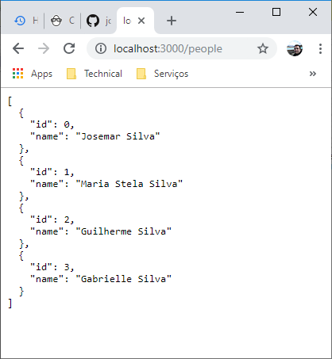

# eval-nodejs-simple-json-server

## 1. Introdução ##

Este repositório contém os artefatos do projeto **eval-nodejs-simple-json-server**, um servidor JSON que responde à chamadas RESTFULL.

Ao final do projeto, você terá uma base de dados em um único arquivo (.json) que pode ser consultada/atualizada por chamadas HTTP.


### 2. Documentação ###

### 2.1. Diagrama de Caso de Uso ###

* n/a

### 2.2. Diagrama de Implantação


### 2.3. Diagrama Modelo de Dados ###

* n/a


## 3. Projeto ##

### 3.1. Pré-requisitos ###

* Node.js v10.14.1 (recomendada)


### 3.2. Guia para Desenvolvimento ###

* Passo #1: [Instalação de instalação dos pacotes e dependências - json-server](#331-Instalação-de-pacotes-e-dependências) conforme o Guia de Configuração
* Passo #2: Criar um arquivo [db.json](./db.json) que manterá o conteúdo e sua base de dados 
 

### 3.3. Guia para Configuração ###


### 3.3.1. Instalação de pacotes e dependências ###

a. Instalação do json-server

```cmd
C:\...\eval-nodejs-simple-json-server> npm install -g json-server
```


### 3.4. Guia para Implantação ###

* n/a


### 3.5. Guia para Teste ###

### 3.5.1. Teste 1: Entendendo mecanismo de consulta, inclusão, alteração, remoção, backups da base###

* Passo #1: Iniciar o `json-server` que implementa os formulários RESTFULL sobre a base de daados `db.json`

```cmd
C:\..\eval-nodejs-simple-json-server>json-server db.json

  \{^_^}/ hi!

  Loading db.json
  Done

  Resources
  http://localhost:3000/people

  Home
  http://localhost:3000

  Type s + enter at any time to create a snapshot of the database
```

* Passo #2: Acesse pelo browser a página principal do servidor em http://localhost:3000


* Passo #3: Acesse pelo browser a página da base de dados armazenada em JSON chamada `people` em http://localhost:3000/people




* Passo #4: Faça uma requisição HTTP GET à base de dados armazenada em JSON chamada `people` 

```cmd
curl -H "Cache-Control: no-cache" http://localhost:3000/people
```

... o resultado esperado ...

```txt
[  { "id": 0, "name": "Josemar Silva" }, 
   { "id": 1, "name": "Maria Stela Silva" }, 
   { "id": 2, "name": "Guilherme Silva" }, 
   { "id": 3, "name": "Gabrielle Silva" } ]
```

PS: Lembre-se que no Windows será preciso escapar o caracter aspas duplas \("\). No Linux, o uso do caracter aspas simples \('\) simplifica a linha de comando.


* Passo #5: Faça uma requisição HTTP POST adicionando um novo registro à base de dados armazenada em JSON chamada `people` 

```cmd
curl -X POST -H "Content-Type: application/json" -d "{ \"name\": \"Nome Novo 1\" }" http://localhost:3000/people
```

```txt
{
  "name": "Nome Novo 1",
  "id": 4
}
```

* Passo #6: Faça uma requisição HTTP GET para **consultar** todos os registros de `people`, observe que o novo registro recém incluído deve aparecer

```cmd
curl -H "Cache-Control: no-cache" http://localhost:3000/people
```

```txt
[  { "id": 0, "name": "Josemar Silva" }, 
   { "id": 1, "name": "Maria Stela Silva" }, 
   { "id": 2, "name": "Guilherme Silva" }, 
   { "id": 3, "name": "Gabrielle Silva" }, 
   { "id": 4, "name": "Nome Novo 1" } ]
```


* Passo #7: Faça uma requisição HTTP PUT para **alterar** o atributo nome do registros de `people` recém inserido:

```cmd
curl -X PUT -H "Content-Type: application/json" -d "{ \"name\": \"Melanie\" }" http://localhost:3000/people/4
```

```txt
{
  "name": "Melanie",
  "id": 4
}
```


* Passo #8: Faça uma requisição HTTP GET para **consultar** todos os registros de `people`, observe que o atributo nome foi alterado. Em seguida faça uma consulta apenas do registro com atributo `id` = 4. Depois faça uma consulta executando buscando por uma query com base no atributo `nome=Melanie`

```cmd
curl -H "Cache-Control: no-cache" http://localhost:3000/people
```

```txt
[  { "id": 0, "name": "Josemar Silva" }, 
   { "id": 1, "name": "Maria Stela Silva" }, 
   { "id": 2, "name": "Guilherme Silva" }, 
   { "id": 3, "name": "Gabrielle Silva" }, 
   { "id": 4, "name": "Melanie" } ]
```

```cmd
curl -H "Cache-Control: no-cache" http://localhost:3000/people/4
curl -H "Cache-Control: no-cache" http://localhost:3000/people?q=Melanie
```

```txt
{
  "name": "Melanie",
  "id": 4
}
```


* Passo #9: Faça uma requisição HTTP DELETE para **remover** o registros recém inserido de `id=4` de `people`. Em seguida uma requisição para incluir vários novos registro e depois consulte parra certificar-se que eles foram acrescentados à base de dados `people` (memória). Observe que o registro recém inserido `{id=4, name="Melanie"}` foi removido.

```cmd
curl -X DELETE -H "Content-Type: application/json" http://localhost:3000/people/4
curl -H "Cache-Control: no-cache" http://localhost:3000/people
curl -X POST -H "Content-Type: application/json" -d "{ \"name\": \"Nome Novo 2\" }" http://localhost:3000/people
curl -X POST -H "Content-Type: application/json" -d "{ \"name\": \"Nome Novo 3\" }" http://localhost:3000/people
curl -H "Cache-Control: no-cache" http://localhost:3000/people
```


* Passo #10: Faça shutdown no json-server e reinicie logo em seguida consultando todos os registros. Observe que todas as alterações foram gravadas imediatamente na base de dados `db.json`.

```cmd
 :
  Type s + enter at any time to create a snapshot of the database
^C
C:\..\eval-nodejs-simple-json-server>json-server db.json
 :
curl -H "Cache-Control: no-cache" http://localhost:3000/people
```


* Passo #9: Faça uma requisição HTTP DELETE para **remover** o registros recém inserido de `id=4` e `id=5` de `people`. Mas antes tire um backup (snapshot) da base de dados, digitando `S` na console. Em seguida analise o conteúdo dos arquivos `db.json` e `db-1547072804728.json`.

```cmd
 :
  Type s + enter at any time to create a snapshot of the database
S
  Saved snapshot to db-1547072804728.json
 :
```

```cmd
curl -X DELETE -H "Content-Type: application/json" http://localhost:3000/people/4
curl -X DELETE -H "Content-Type: application/json" http://localhost:3000/people/5
curl -H "Cache-Control: no-cache" http://localhost:3000/people
```


### 3.5.2. Teste 2: Entendendo os módulos faker e loadash ###

* Passo #1: Instalando os módulos `faker` e `loadash`

```cmd
npm install faker loadash
```

```txt
+ faker@4.1.0
+ loadash@1.0.0
added 1 package, updated 1 package and audited 3 packages in 10.001s
found 0 vulnerabilities
```


* Passo #2: Crie o arquivo `generate.js` com o conteúdo [generate.js](generate.js)


### 3.6. Guia para Execução ###

* n/a


### 3.7. Guia de Credenciais de Acesso ###

* n/a


## Referências ##

* Sobre instalação:
  * https://blog.teamtreehouse.com/install-node-js-npm-windows
  * https://nodejs.org/en/download/
* Sites e dicas impressionantes sobre Node.js:
  * https://github.com/typicode/json-server
  * https://github.com/sqreen/awesome-nodejs-projects
* Sobre vídeos de tutorial
  * https://egghead.io/lessons/javascript-creating-demo-apis-with-json-server
* Sobre o comando curl
  * https://curl.haxx.se/docs/manpage.html
